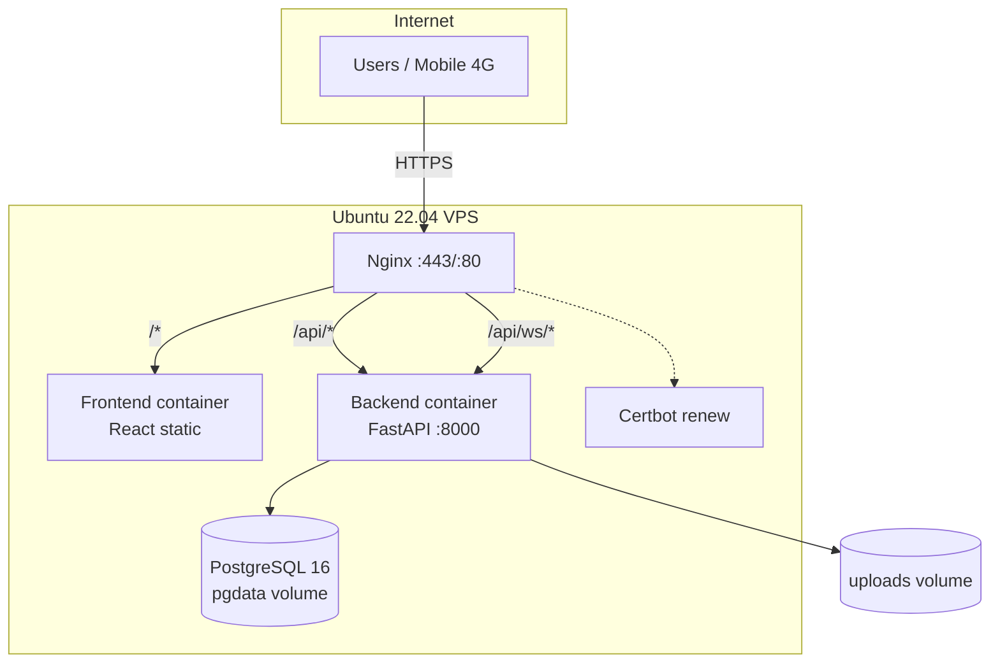

# Infrastructure architecture — Plateforme Santé Guinée

## Overview

## Components

| Layer | Technology | Responsibility |
|-------|------------|----------------|
| Edge | Nginx 1.27 | TLS termination, reverse proxy, gzip, security headers, WebSocket upgrade |
| UI | React + Vite | SPA, role-based routing, teleconsultation room |
| API | FastAPI + Uvicorn | REST, JWT auth, rate limits, teleconsultation access control |
| Real-time | WebSocket `/ws/health`, `/ws/live` | Proxy health + authenticated live channel |
| Data | PostgreSQL 16 | Persistent appointments, users, messages, payments |
| Migrations | Alembic + `create_all` | Versioned schema + idempotent bootstrap |
| Secrets | `.env` on server only | Never committed; `SECRET_KEY`, Stripe, Jitsi JWT |
| Monitoring | JSON logs + optional Sentry | `LOG_FORMAT=json`, `SENTRY_DSN` |

## Network paths

| Client request | Nginx | Backend |
|----------------|-------|---------|
| `GET /` | → frontend:80 | — |
| `GET /api/health` | strip `/api` → `/health` | FastAPI |
| `WSS /api/ws/health` | upgrade → `/ws/health` | WebSocket |
| `GET /uploads/...` | → backend | Static mount |

## Environments

| Env | Compose files | Domain | Docs |
|-----|---------------|--------|------|
| Local Docker | `docker-compose.yml` | localhost | enabled |
| Staging | `+ docker-compose.staging.yml` | `staging.*` | disabled by default |
| Production | `+ docker-compose.prod.yml` | production domain | disabled |

## Teleconsultation

1. Patient/doctor opens `/consultation/:id`
2. Frontend calls `GET /api/teleconsultation/appointments/{id}/access`
3. Backend validates role, status, time window
4. Returns `meeting_url`, optional `jitsi_jwt` (self-hosted Jitsi)
5. `POST .../end` marks appointment completed

## Data persistence

- `pgdata` Docker volume — survives container restarts
- `uploads` volume — message attachments
- Backups: `deploy/vps/backup-db.sh`, verify: `scripts/db/backup_verify.sh`
