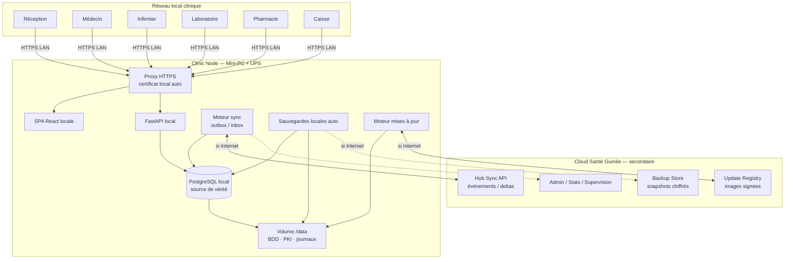

# Architecture Offline-First — Plateforme Santé Guinée

**Statut :** Direction **validée** (2026-07-28) — décisions d’architecture figées ci-dessous  
**Implémentation :** **interdite** tant que ce document reste la référence non encore décomposée en tickets d’exécution  
**Date :** 2026-07-28 (rév. décisions validées)  
**Frontend cloud de référence :** `https://plateforme-sante-guinee.vercel.app`  
**Backend cloud actuel :** FastAPI + PostgreSQL (Railway)  
**Public cible :** produit, architecture, sécurité, ops cliniques, techniciens terrain  

> Objectif métier : **fonctionnement clinique quotidien 100 % sans Internet, durée illimitée**.  
> Internet n’est requis que pour : synchronisation, sauvegarde distante, mises à jour, supervision, administration centrale, statistiques, restauration après sinistre.

---

## 0. Décisions d’architecture validées

| # | Décision | Statut |
|---|----------|--------|
| D1 | Modèle **Clinic Node** : FastAPI local + PostgreSQL local + SPA en LAN | **Validé** |
| D2 | **HTTPS LAN dès la V1** ; certificat local généré à l’installation | **Validé** |
| D3 | **Matériel de référence** (NUC/équivalent, SSD, ≥16 Go RAM, UPS) ; compatibilité matériels équivalents | **Validé** |
| D4 | Stock pharmacie : sync par **deltas uniquement** + **historique complet** des mouvements | **Validé** |
| D5 | Hospitalisation & imagerie : **prévues dans l’architecture** ; implémentation métier en **V1.1** | **Validé** |
| D6 | Cloud **secondaire** : backup, sync, updates, supervision, admin centrale, stats, DR — jamais le système principal des soins | **Validé** |
| D7 | **Zéro perte de données** patient : opérations transactionnelles + journalisées | **Validé** |
| D8 | **Installation < 30 minutes** par un technicien terrain | **Validé** |
| D9 | **Disaster Recovery** détaillé ; objectif de reprise clinique **< 1 heure** sans perte des données persistées | **Validé** |

---

## 1. Principes directeurs

1. **Local-first, cloud-second** — la source de vérité opérationnelle est le Clinic Node.  
2. **Internet jamais sur le chemin critique** des soins, de l’accueil, du labo, de la pharmacie, de la caisse.  
3. **Multi-utilisateur en LAN** sur une seule BDD locale.  
4. **Cloisonnement par clinique** (`clinic_id` + secrets nœud).  
5. **Zéro perte** — ACID + journal d’événements + backups + sync idempotente.  
6. **Continuité produit** — réutiliser FastAPI / SQLAlchemy / React en **mode clinic-node**.  
7. **Simplicité d’ops** — une appliance standard, une procédure d’install courte, un matériel de référence.

---

## 2. Schéma d’architecture de référence

Ce schéma est la **référence technique du projet**.

```text
╔══════════════════════════════════════════════════════════════════════════════════════════╗
║                              CLOUD SANTÉ GUINÉE (secondaire)                             ║
║                                                                                          ║
║   ┌─────────────────┐  ┌─────────────────┐  ┌─────────────────┐  ┌────────────────────┐ ║
║   │ Hub Sync API    │  │ Backup Store    │  │ Update Registry │  │ Admin / Stats /    │ ║
║   │ (événements)    │  │ (snapshots      │  │ (images signées)│  │ Supervision multi- │ ║
║   │                 │  │  chiffrés)      │  │                 │  │ cliniques          │ ║
║   └────────▲────────┘  └────────▲────────┘  └────────▲────────┘  └─────────▲──────────┘ ║
║            │                    │                    │                     │            ║
╚════════════╪════════════════════╪════════════════════╪═════════════════════╪════════════╝
             │ HTTPS              │ HTTPS              │ HTTPS               │ HTTPS
             │ (si Internet)      │ (si Internet)      │ (si Internet)       │ (si Internet)
             │                    │                    │                     │
╔════════════╪════════════════════╪════════════════════╪═════════════════════╪════════════╗
║            │         CLINIQUE — RÉSEAU LOCAL PRIVÉ (LAN) — AUTONOME        │            ║
║            │                    │                    │                     │            ║
║   ┌────────┴────────────────────┴────────────────────┴─────────────────────┴──────────┐ ║
║   │                        CLINIC NODE (Mini-PC / NUC de référence)                   │ ║
║   │                              + UPS (obligatoire)                                  │ ║
║   │                                                                                   │ ║
║   │  ┌──────────────┐   ┌──────────────┐   ┌──────────────┐   ┌──────────────────┐  │ ║
║   │  │ Proxy HTTPS  │──▶│ FastAPI      │──▶│ PostgreSQL   │   │ Volume /data     │  │ ║
║   │  │ (TLS local,  │   │ (mode clinic │   │ local        │   │ (BDD, fichiers,  │  │ ║
║   │  │  cert auto)  │   │  node)       │   │              │   │  journaux, PKI)  │  │ ║
║   │  └──────▲───────┘   └──────┬───────┘   └──────────────┘   └────────▲─────────┘  │ ║
║   │         │                  │                                       │            │ ║
║   │         │           ┌──────┴───────┐                               │            │ ║
║   │         │           │ SPA React    │ (servie en local)             │            │ ║
║   │         │           └──────────────┘                               │            │ ║
║   │         │                                                          │            │ ║
║   │  ┌──────┴──────────┐  ┌────────────────┐  ┌────────────────────┐  │            │ ║
║   │  │ Sync engine     │  │ Backup engine  │  │ Update engine      │──┘            │ ║
║   │  │ outbox / inbox  │  │ snapshots      │  │ images + migrate   │               │ ║
║   │  │ deltas métier   │  │ locaux + cloud │  │ blue/green local   │               │ ║
║   │  └─────────────────┘  └───────┬────────┘  └────────────────────┘               │ ║
║   │                              │                                                 │ ║
║   │                     ┌────────▼────────┐                                        │ ║
║   │                     │ Sauvegarde      │  (SSD interne + 2e disque optionnel /  │ ║
║   │                     │ locale auto     │   NAS pour grandes cliniques)          │ ║
║   │                     └─────────────────┘                                        │ ║
║   └────────────────────────────────────────────────────────────────────────────────┘ ║
║            ▲ HTTPS LAN                                                               ║
║            │                                                                         ║
║   ┌────────┴────────┬──────────────┬──────────────┬──────────────┬──────────────┐  ║
║   │                 │              │              │              │              │  ║
║   ▼                 ▼              ▼              ▼              ▼              ▼  ║
║ ┌────────┐   ┌──────────┐  ┌──────────┐  ┌──────────┐  ┌──────────┐  ┌────────┐ ║
║ │Poste   │   │Poste     │  │Poste     │  │Poste     │  │Poste     │  │Poste  │ ║
║ │Réception│  │Médecin   │  │Infirmier │  │Laboratoire│ │Pharmacie │  │Caisse │ ║
║ │(SPA)   │   │(SPA)     │  │(SPA)     │  │(SPA)     │  │(SPA)     │  │(SPA)  │ ║
║ └────────┘   └──────────┘  └──────────┘  └──────────┘  └──────────┘  └────────┘ ║
║                                                                                  ║
║   Imprimantes (PDF / reçus) ── via navigateurs ou partage LAN                    ║
╚══════════════════════════════════════════════════════════════════════════════════╝
```

### Variante Mermaid (même référence)



### Lecture du schéma

| Zone | Rôle |
|------|------|
| Postes métiers | Clients légers (navigateur) ; aucun stockage métier critique |
| Proxy HTTPS | Termine TLS LAN ; certificat local installé automatiquement |
| FastAPI | Toute la logique métier + auth locale |
| PostgreSQL local | Source de vérité de la clinique |
| Sync engine | Pousse/tire des **événements / deltas** vers le cloud |
| Backup engine | Snapshots locaux automatiques + upload distant opportuniste |
| Update engine | Télécharge / applique versions sans toucher au volume data |
| Cloud | Hub secondaire uniquement |

---

## 3. Architecture générale des composants

### 3.1 Clinic Node (cœur)

Appliance Docker Compose standard :

1. `proxy` — Caddy (ou Nginx) **HTTPS obligatoire**  
2. `api` — FastAPI mode clinic-node  
3. `db` — PostgreSQL 16+  
4. `sync-agent` — moteur de synchronisation  
5. `backup-agent` — sauvegardes  
6. `update-agent` — mises à jour  
7. `web` — assets SPA  

Les agents peuvent être co-localisés dans l’API en première livraison technique, puis séparés sans changer le modèle.

### 3.2 Matériel de référence (validé)

| Élément | Spécification de référence |
|---------|----------------------------|
| Ordinateur | Mini-PC type **Intel NUC** ou équivalent x86_64 |
| Stockage | **SSD** qualité (endurance clinique) |
| Mémoire | **16 Go RAM minimum** |
| Alimentation | **UPS / onduleur obligatoire** |
| Sauvegarde locale | Automatique sur volume dédié (partition / 2e SSD) |
| NAS | Optionnel, recommandé pour **grandes cliniques** (rétention longue) |
| Réseau | Switch Ethernet et/ou Wi-Fi clinique dédié ; IP fixe du serveur |

**Compatibilité :** tout matériel équivalent (CPU x86_64, SSD, ≥16 Go RAM, UPS) doit pouvoir exécuter la même appliance. Le matériel de référence simplifie support et documentation ; il n’est pas un verrou constructeur.

### 3.3 Rôle du cloud (validé — secondaire)

Le cloud **n’est pas** le système principal. Chaque clinique reste **totalement autonome**.

Usages cloud exclusivement :

- sauvegardes distantes chiffrées  
- synchronisation d’événements / deltas  
- distribution des mises à jour  
- supervision (santé nœuds, dernière sync, espace disque)  
- administration centrale multi-cliniques  
- statistiques agrégées  
- restauration après sinistre (copie offsite)

Même si Internet disparaît plusieurs semaines : **la clinique continue normalement**.

---

## 4. Base de données locale

### 4.1 Choix

**PostgreSQL local** — aligné sur le code actuel, transactions ACID, multi-utilisateurs concurrent.

### 4.2 Responsabilités

- Données métier (patients, soins, labo, pharmacie, facturation, …)  
- Tables techniques : `sync_outbox`, `sync_inbox`, `sync_cursor`, `sync_conflicts`, `idempotency_keys`, `node_metadata`  
- Journal d’audit append-only  
- Historique des mouvements de stock (`stock_movements`)  

### 4.3 Identifiants

| Entité | Stratégie |
|--------|-----------|
| `clinic_id` | Attribué à l’installation |
| `node_id` | UUID unique du Clinic Node |
| Entités métier | `id` local + `entity_uid` UUID global |
| Numéros affichés (PAT/INV/ADM) | Générés localement avec préfixe clinique |

La sync utilise `entity_uid` / clés métier, jamais les seuls auto-incréments locaux.

### 4.4 Modules prévus dès l’architecture (implémentation échelonnée)

| Module | Schéma / API prévus dès V1 architecture | Implémentation UI/métier |
|--------|----------------------------------------|---------------------------|
| Accueil, soins, labo, pharmacie, caisse | Oui | V1 |
| **Hospitalisation / lits** | Oui (tables, events, droits) | **V1.1** |
| **Imagerie** | Oui (orders/results/events) | **V1.1** |

Aucune dette structurante : les streams sync et le modèle de données incluent ces domaines dès le départ.

---

## 5. Authentification locale et sessions

- Auth **100 % locale** (hash mots de passe en BDD locale).  
- JWT / refresh signés avec `NODE_JWT_SECRET` local.  
- Reset quotidien : admin clinique local ; email seulement si Internet + politique activée.  
- RBAC inchangé conceptuellement (`receptionist`, `doctor`, `nurse`, `lab_technician`, `pharmacist`, `cashier`, `clinic_admin`, …).  
- Timeout d’inactivité SPA obligatoire.  
- Horloge : NTP / contrôle de dérive (alerte admin).

---

## 6. HTTPS sur le réseau local (V1)

### 6.1 Exigence

Dès la V1, tous les postes accèdent au Clinic Node en **HTTPS**.  
Objectif : protéger les données médicales même sur un LAN clinique.

### 6.2 Certificat local automatique

À l’installation (`install.sh` / first-boot) :

1. Génération d’une **CA locale** du nœud (stockée dans `/data/pki`).  
2. Génération d’un certificat serveur pour les noms/IP locaux (`sante-locale`, IP LAN).  
3. Configuration du proxy (Caddy recommandé pour renouvellement/local TLS simple).  
4. Export d’un **petit paquet trust** (certificat CA) à installer une fois sur les postes Windows/Linux (script fourni), **ou** page d’aide « faire confiance au certificat » pour le navigateur.

### 6.3 Noms d’accès

- `https://sante-locale` (mDNS / DNS local)  
- `https://<ip-fixe>` en secours  

HTTP clair : **redirigé vers HTTPS** (pas de mode production en HTTP).

---

## 7. Réseau local multi-utilisateurs

- IP fixe du Clinic Node (réservation DHCP).  
- Postes : navigateurs modernes uniquement.  
- Concurrence : transactions PostgreSQL + verrouillage optimiste (`version` / `updated_at`) sur dossiers sensibles.  
- Pas d’exposition Internet entrante du nœud.  
- Sortie HTTPS sortante uniquement pour sync / backup / update (coupable volontairement = air-gap).

---

## 8. Moteur de synchronisation

### 8.1 Modèle

**Event / delta outbox** — jamais de « dump complet de la base » comme mécanisme de sync.

Chaque mutation métier = transaction qui écrit :

1. l’état métier  
2. un événement dans `sync_outbox` (atomique)

### 8.2 Stock pharmacie (validé)

- Quantité courante = **projection** reconstruisible.  
- Toute entrée/sortie/ajustement/dispensation = ligne dans `stock_movements` (historique append-only).  
- Sync cloud = **deltas de mouvements**, pas remplacement aveugle du stock.  
- En cas de doute : rejouer l’historique des mouvements pour reconstruire le stock.

### 8.3 Flux

| Direction | Contenu |
|-----------|---------|
| Push clinique → cloud | Événements patients, soins, labo, Rx, **mouvements stock**, facturation, audit |
| Pull cloud → clinique | Catalogues versionnés, politiques, corrections admin rares |

### 8.4 Garanties sync

- Idempotence (`event_id`, `idempotency_key`)  
- ACK cloud avant marquage outbox  
- Retry exponentiel  
- Conflits explicites (UI admin) — pas d’écrasement silencieux de faits cliniques  

---

## 9. Gestion des conflits (rappel)

| Type | Stratégie |
|------|-----------|
| Texte clinique concurrent | Historiser les deux versions + file conflit |
| Stock | Deltas / mouvements uniquement |
| Paiements | Machine à états + idempotency |
| Catalogues | Version cloud + `local_override` |

Avec un seul Clinic Node, les conflits intra-LAN restent des courses BDD classiques ; les conflits majeurs apparaissent surtout clinique ↔ cloud après longue déconnexion.

---

## 10. Zéro perte de données (exigence D7)

### 10.1 Règles non négociables

1. Toute opération métier réussie est **commitée en transaction ACID**.  
2. Toute opération métier génère un **événement journalisé** (outbox et/ou audit).  
3. Aucun DELETE dur des audits / mouvements de stock.  
4. Soft-delete pour patients / dossiers lorsque suppression fonctionnelle.  
5. Brouillons autosave sur formulaires longs (réception, consultation) pour limiter la perte des saisies non encore soumises.  
6. Interdiction des jobs de reset destructifs sur nœud de production.  
7. Backup local automatique **avant** toute migration / update.

### 10.2 Couverture des pannes

| Événement | Garantie |
|-----------|----------|
| Coupure Internet | Aucun impact sur commits locaux ; outbox conserve tout |
| Coupure électrique | UPS + crash recovery PostgreSQL (WAL) ; actes commités conservés |
| Redémarrage brutal | Idem WAL ; restart automatique des services |
| Fermeture inattendue du navigateur | Données déjà soumises persistées ; brouillons locaux pour le reste |

**Définition de « zéro perte » :** aucune donnée **déjà validée/soumise** ne peut disparaître. Les frappes non soumises sont mitigées par autosave, pas par magie réseau.

---

## 11. Sauvegardes

### 11.1 Locales (toujours)

| Type | Fréquence cible | Support |
|------|-----------------|--------|
| Snapshot `pg_dump` / base backup | Toutes les **15–60 min** (paramétrable ; défaut 30 min) | Volume backup local |
| WAL / PITR | Continu si activé | Volume backup |
| Copie vers 2e disque | Quotidienne + après chaque snapshot « daily » | 2e SSD |
| NAS (grandes cliniques) | Quotidienne | NAS LAN |

### 11.2 Distantes (opportunistes)

- Upload chiffré AES-256-GCM vers cloud object store.  
- Metadata : `clinic_id`, `node_id`, `backup_id`, versions, hash.  
- Si offline prolongé : rétention 100 % locale jusqu’au retour réseau.

### 11.3 Vérification

- Restore test automatisé hebdomadaire en sandbox local.  
- Alerte si aucun backup réussi > 6 h (local) ou > 48 h (distant, si Internet attendu).

---

## 12. Chiffrement

| Couche | Mesure |
|--------|--------|
| Disque `/data` | LUKS (ou équivalent) |
| Backups | Chiffrement applicatif avant stockage/upload |
| LAN | HTTPS (TLS) obligatoire |
| Cloud | TLS 1.2+ |
| Secrets | Fichiers protégés ; hors Git |

Clé maître clinique créée à l’installation ; procédure de coffre (copie admin) documentée.

---

## 13. Reprise après coupure Internet

- États nœud : `ONLINE` / `DEGRADED` / `OFFLINE`.  
- UI : bandeau « Hors ligne Internet — clinique opérationnelle ».  
- À la reprise : drain outbox → pull catalogues → rapport sync.  
- Aucun redémarrage utilisateur obligatoire.

---

## 14. Mises à jour logicielles

- Données **toujours** hors image (`/data` persistant).  
- Update agent : download (réseau ou USB signée) → backup obligatoire → migrate → healthcheck → bascule.  
- Rollback image si échec.  
- Fenêtre courte (cible < 2 min d’indisponibilité API) ou créneau planifié.  
- HTTPS et certificats locaux **conservés** (PKI dans `/data/pki`).

---

## 15. Installation extrêmement simple (< 30 minutes)

### 15.1 Objectif

Un technicien arrive, installe le serveur, connecte les postes, et la clinique travaille.

### 15.2 Procédure cible (chrono)

| Étape | Durée indicative | Action |
|-------|------------------|--------|
| 1 | 5 min | Brancher NUC + UPS + réseau ; IP fixe |
| 2 | 5 min | Boot clé USB d’installation (ou image préchargée) ; lancer `install` |
| 3 | 5 min | Saisir paquet d’activation clinique (QR / fichier chiffré fourni par le cloud) |
| 4 | 5 min | Génération auto HTTPS + premier admin local |
| 5 | 5 min | Connecter 1–2 postes ; installer confiance CA (script) ; login test |
| 6 | 5 min | Parcours smoke : créer patient test, facture test, imprimer |

**Total ≤ 30 min** pour une clinique standard.

### 15.3 Livrables d’installation

- Image / clé USB signée « Santé Guinée Clinic Node »  
- Paquet d’activation par clinique (`clinic_id`, catalogues initiaux, bootstrap admin)  
- Guide papier 1 page + checklist  
- Compte rendu d’installation (version, node_id, IP, heure)

---

## 16. Déploiement multi-cliniques

- 1 clinique = 1 Clinic Node autonome.  
- Cloud : inventaire nœuds, versions, dernière sync, alertes DR.  
- Révocation nœud volé : rotation `node_secret` + procédure wipe.  
- Pas de sync directe clinique ↔ clinique.

---

## 17. Scalabilité et maintenance

- 5–20 users : NUC 16 Go suffit.  
- Grandes cliniques : RAM/SSD ↑ + NAS.  
- Observabilité locale : disque, outbox, âge sync, backups, UPS.  
- Patch OS / test restore : calendrier ops.

---

## 18. Sécurité globale

Accès physique serveur · RBAC · audit · volume chiffré · HTTPS LAN · updates signées · pas d’admin cloud requis pour les soins · journalisation des accès dossiers.

---

## 19. Périmètre fonctionnel

| Module | Offline V1 | Notes |
|--------|------------|-------|
| Auth staff | Oui | Local |
| Réception / facturation / caisse | Oui | |
| Infirmier / médecin / labo / pharmacie | Oui | Stock = deltas + historique |
| Impressions PDF | Oui | |
| Hospitalisation | Architecture prête | **Métier V1.1** |
| Imagerie | Architecture prête | **Métier V1.1** |
| Sync / backup / updates / supervision | Opportuniste cloud | |
| Admin plateforme / stats globales | Cloud | |

---

## 20. Scénarios opérationnels

### 20.1 Sans Internet pendant un mois

Soins normaux sur LAN ; outbox et backups locaux ; reprise sync au retour ; **zéro blocage clinique**.

### 20.2 Panne électrique

UPS → shutdown propre si possible ; sinon crash recovery PostgreSQL ; restart auto ; actes commités intacts ; brouillons pour saisies non soumises.

### 20.3 Sync après plusieurs jours offline

Drain outbox par lots, dédup cloud, pull catalogues, UI conflits si besoin, rapport de sync.

### 20.4 Nouvelle version logicielle

Backup → bascule image → migrate → health → rollback si besoin ; `/data` intact ; PKI intacte.

### 20.5 Clinique « air-gap » volontaire

Couper la sortie Internet : aucun impact soins ; sync/backup distant en pause.

---

## 21. Disaster Recovery (reprise après sinistre) — référence

### 21.1 Objectifs

| Indicateur | Cible |
|------------|-------|
| **RTO** (clinique à nouveau opérationnelle) | **< 1 heure** |
| **RPO** (perte maximale de données commitées) | **≤ 30 minutes** (intervalle snapshot local) ; → minutes si PITR/WAL actif |
| Perte de dossiers patients validés | **Interdite** |

Prérequis transverses toujours en place :

- Snapshots locaux automatiques fréquents  
- Copie sur **2e support** (2e SSD) autant que possible  
- Backup cloud chiffré dès qu’Internet existe  
- Clé de déchiffrement des backups disponible hors serveur (coffre admin / siège)  
- Clé USB d’installation + dernière image applicative  
- Inventaire `clinic_id` / `node_id` connu du cloud  

### 21.2 Matrice des sinistres

#### A) Mini-PC / NUC en panne (carte mère, alimentation, etc.)

| Étape | Action | Durée indicative |
|-------|--------|------------------|
| 1 | Constater panne ; basculer sur UPS/arrêt | 5 min |
| 2 | Remplacer par NUC de secours (stock siège / kit terrain) **ou** équivalent | 10 min |
| 3 | Brancher le **SSD data** d’origine s’il est sain **ou** attacher le 2e disque de backup | 5 min |
| 4 | Boot clé d’install → « Restaurer depuis backup local » | 15–25 min |
| 5 | Vérifier HTTPS, login admin, smoke patient/facture | 10 min |
| 6 | Reprise soins | — |

**Si le SSD data d’origine est sain :** remontage du volume `/data` sur nouveau NUC (plus rapide, souvent < 30–40 min).  
**Si SSD data perdu :** restore depuis 2e disque / dernier snapshot (voir B).

#### B) SSD principal défectueux

| Étape | Action |
|-------|--------|
| 1 | Remplacer le SSD |
| 2 | Installer appliance (USB) |
| 3 | Restore du **dernier snapshot vérifié** depuis 2e disque / NAS |
| 4 | Appliquer WAL si disponible (PITR) pour coller au RPO |
| 5 | Smoke tests + reprise |
| 6 | Dès Internet : resynchroniser avec le cloud (réconciliation) |

**Sans 2e disque local :** restore depuis **backup cloud** (exige Internet + clé de déchiffrement) — toujours viser RTO < 1 h si le dernier backup distant < 30–60 min et la bande passante locale est correcte ; sinon RTO dépend du téléchargement (mitigation : toujours un 2e support local).

#### C) Serveur volé

| Étape | Action |
|-------|--------|
| 1 | Alerte immédiate ; **révoquer** le `node_secret` côté cloud (nœud compromis) |
| 2 | Considérer le volume volé comme exposé mais **chiffré au repos** (LUKS) — réduire le risque de lecture |
| 3 | Nouveau NUC + restore depuis 2e disque resté sur site **ou** backup cloud |
| 4 | Nouvel `node_id` secret ; ré-enrolment cloud |
| 5 | Rotation mots de passe staff recommandée |
| 6 | Reprise soins après smoke tests |

Les données patients ne sont pas « perdues » si une copie backup (2e disque ou cloud) existe — c’est une exigence d’ops obligatoire.

#### D) Ransomware / chiffrement malveillant du serveur

| Étape | Action |
|-------|--------|
| 1 | **Isoler** la machine du LAN (débrancher réseau) |
| 2 | Ne pas payer / ne pas « négocier » avec l’attaquant |
| 3 | Provisionner un **NUC propre** (image d’install saine) |
| 4 | Restore uniquement depuis backup **hors ligne** (2e disque déconnecté au moment de l’attaque, ou cloud) — **jamais** depuis un volume suspect |
| 5 | Vérifier intégrité (hash backup, compteurs patients) |
| 6 | Remettre en service ; audit accès ; rotation secrets |
| 7 | Analyse forensique du matériel infecté hors prod |

**Prévention :** PAS d’admin quotidien en root sur le poste serveur ; updates signées ; PAS de navigation web sur le NUC ; comptes utilisateurs limités.

#### E) Erreur humaine (suppression massive de dossiers)

| Étape | Action |
|-------|--------|
| 1 | Stopper immédiatement les suppressions ; passer la clinique en lecture seule si besoin |
| 2 | Identifier l’heure de l’erreur (`occurred_at`) |
| 3 | **Point-in-time recovery** : restore snapshot + WAL à T−ε avant l’erreur **ou** |
| 4 | Restauration sélective des `entity_uid` depuis backup / journal d’événements |
| 5 | Soft-deleted : restauration native (undelete admin) si encore en fenêtre soft-delete |
| 6 | Rapport d’incident + formation |

Les suppressions métiers sont soft-delete + journal ; le hard-delete massif n’est pas exposé à la réception.

### 21.3 Kit de reprise terrain (contenu obligatoire)

- 1 NUC de secours (ou équivalent)  
- 1 SSD vierge  
- Clé USB d’installation signée  
- Document des `clinic_id` / procédure d’activation  
- Copie offline de la clé de déchiffrement backups (coffre)  
- Checklist DR 1 page  

### 21.4 Exercices

- Simulation restore **trimestrielle** par clinique ou par région.  
- Mesure réelle du RTO ; écart → correctifs ops.

---

## 22. Plan de livraison (après validation d’exécution)

| Phase | Objectif |
|-------|--------|
| **P0** | Appliance + Postgres + SPA locale + **HTTPS auto** + auth locale + install < 30 min |
| **P1** | Parité modules V1 (accueil → caisse) + zéro perte (transactions, journaux, brouillons) |
| **P2** | Sync deltas + historique stock + hub cloud |
| **P3** | Backup local fréquent + offsite + update agent + USB |
| **P4** | DR kit, PITR, exercices restore, durcissement (TOTP admin, mTLS optionnel) |
| **V1.1** | Hospitalisation + imagerie (schéma déjà prévu) |

Chaque phase se termine par recette des scénarios §20 et §21.

---

## 23. Critères d’acceptation (architecture)

- [x] Direction Clinic Node validée  
- [x] HTTPS LAN V1 + cert auto  
- [x] Matériel de référence + compatibilité équivalents  
- [x] Stock = deltas + historique  
- [x] Hospit / imagerie dans l’architecture, métier V1.1  
- [x] Cloud secondaire (liste d’usages figée)  
- [x] Zéro perte des données soumises  
- [x] Install < 30 min  
- [x] Schéma d’architecture de référence  
- [x] DR détaillé avec RTO < 1 h  

**Prochaine étape :** décomposition en tickets d’implémentation P0 — **pas de code** tant que le plan d’exécution n’est pas ordonné explicitement.

---

## 24. Références

- Frontend cloud : `https://plateforme-sante-guinee.vercel.app`  
- Roadmap PWA historique (subordonnée) : `docs/OFFLINE_STRATEGY_ROADMAP.md`

---

*Document d’architecture — décisions validées le 2026-07-28.*
