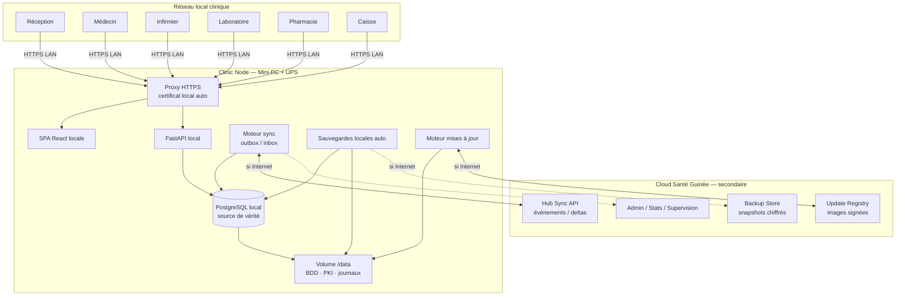

# Architecture Offline-First — Plateforme Santé Guinée

**Statut :** Direction **validée** (2026-07-28) — décisions d’architecture figées ci-dessous  
**Implémentation :** **interdite** tant que ce document reste la référence non encore décomposée en tickets d’exécution  
**Date :** 2026-07-28 (rév. décisions validées + ops / licences / migration)  
**Frontend cloud de référence :** `https://plateforme-sante-guinee.vercel.app`  
**Backend cloud actuel :** FastAPI + PostgreSQL (Railway)  
**Public cible :** produit, architecture, sécurité, ops cliniques, techniciens terrain, owner  

> Objectif métier : **fonctionnement clinique quotidien 100 % sans Internet, durée illimitée**.  
> Internet n’est requis que pour : synchronisation, sauvegarde distante, mises à jour, supervision, administration centrale, statistiques, restauration après sinistre, activation/renouvellement de licence (hors période de grâce).

---

## 0. Décisions d’architecture validées

| # | Décision | Statut |
|---|----------|--------|
| D1 | Modèle **Clinic Node** : FastAPI local + PostgreSQL local + SPA en LAN | **Validé** |
| D2 | **HTTPS LAN dès la V1** ; certificat local généré à l’installation | **Validé** |
| D3 | **Matériel de référence** (NUC/équivalent, SSD, ≥16 Go RAM, UPS) ; compatibilité matériels équivalents | **Validé** |
| D4 | Stock pharmacie : sync par **deltas uniquement** + **historique complet** des mouvements | **Validé** |
| D5 | Hospitalisation & imagerie : **prévues dans l’architecture** ; implémentation métier en **V1.1** | **Validé** |
| D6 | Cloud **secondaire** : backup, sync, updates, supervision, admin centrale, stats, DR — jamais le système principal des soins | **Validé** |
| D7 | **Zéro perte de données** patient : opérations transactionnelles + journalisées | **Validé** |
| D8 | **Installation < 30 minutes** par un technicien terrain | **Validé** |
| D9 | **Disaster Recovery** détaillé ; objectif de reprise clinique **< 1 heure** sans perte des données persistées | **Validé** |
| D10 | **Licences** liées à la clinique : activation initiale Internet, grâce multi-mois offline, renouvellement transparent | **Validé** |
| D11 | **Administration à distance** (télémétrie ops) sans accès aux données médicales patients | **Validé** |
| D12 | **Déploiement USB ultra-simple** : mini-PC + UPS + clé USB → tout automatique, aucune commande complexe | **Validé** |
| D13 | **Migration Cloud (Railway) → Clinic Node** documentée, sans perte, interruption minimale | **Validé** |
| D14 | **Tableau de bord Owner** : sync, offline, backups, disque, version, état serveur | **Validé** |

---

## 1. Principes directeurs

1. **Local-first, cloud-second** — la source de vérité opérationnelle est le Clinic Node.  
2. **Internet jamais sur le chemin critique** des soins, de l’accueil, du labo, de la pharmacie, de la caisse.  
3. **Multi-utilisateur en LAN** sur une seule BDD locale.  
4. **Cloisonnement par clinique** (`clinic_id` + secrets nœud).  
5. **Zéro perte** — ACID + journal d’événements + backups + sync idempotente.  
6. **Continuité produit** — réutiliser FastAPI / SQLAlchemy / React en **mode clinic-node**.  
7. **Simplicité d’ops** — une appliance standard, une procédure d’install courte, un matériel de référence.

---

## 2. Schéma d’architecture de référence

Ce schéma est la **référence technique du projet**.

```text
╔══════════════════════════════════════════════════════════════════════════════════════════╗
║                              CLOUD SANTÉ GUINÉE (secondaire)                             ║
║                                                                                          ║
║   ┌─────────────────┐  ┌─────────────────┐  ┌─────────────────┐  ┌────────────────────┐ ║
║   │ Hub Sync API    │  │ Backup Store    │  │ Update Registry │  │ Admin / Stats /    │ ║
║   │ (événements)    │  │ (snapshots      │  │ (images signées)│  │ Supervision multi- │ ║
║   │                 │  │  chiffrés)      │  │                 │  │ cliniques          │ ║
║   └────────▲────────┘  └────────▲────────┘  └────────▲────────┘  └─────────▲──────────┘ ║
║            │                    │                    │                     │            ║
╚════════════╪════════════════════╪════════════════════╪═════════════════════╪════════════╝
             │ HTTPS              │ HTTPS              │ HTTPS               │ HTTPS
             │ (si Internet)      │ (si Internet)      │ (si Internet)       │ (si Internet)
             │                    │                    │                     │
╔════════════╪════════════════════╪════════════════════╪═════════════════════╪════════════╗
║            │         CLINIQUE — RÉSEAU LOCAL PRIVÉ (LAN) — AUTONOME        │            ║
║            │                    │                    │                     │            ║
║   ┌────────┴────────────────────┴────────────────────┴─────────────────────┴──────────┐ ║
║   │                        CLINIC NODE (Mini-PC / NUC de référence)                   │ ║
║   │                              + UPS (obligatoire)                                  │ ║
║   │                                                                                   │ ║
║   │  ┌──────────────┐   ┌──────────────┐   ┌──────────────┐   ┌──────────────────┐  │ ║
║   │  │ Proxy HTTPS  │──▶│ FastAPI      │──▶│ PostgreSQL   │   │ Volume /data     │  │ ║
║   │  │ (TLS local,  │   │ (mode clinic │   │ local        │   │ (BDD, fichiers,  │  │ ║
║   │  │  cert auto)  │   │  node)       │   │              │   │  journaux, PKI)  │  │ ║
║   │  └──────▲───────┘   └──────┬───────┘   └──────────────┘   └────────▲─────────┘  │ ║
║   │         │                  │                                       │            │ ║
║   │         │           ┌──────┴───────┐                               │            │ ║
║   │         │           │ SPA React    │ (servie en local)             │            │ ║
║   │         │           └──────────────┘                               │            │ ║
║   │         │                                                          │            │ ║
║   │  ┌──────┴──────────┐  ┌────────────────┐  ┌────────────────────┐  │            │ ║
║   │  │ Sync engine     │  │ Backup engine  │  │ Update engine      │──┘            │ ║
║   │  │ outbox / inbox  │  │ snapshots      │  │ images + migrate   │               │ ║
║   │  │ deltas métier   │  │ locaux + cloud │  │ blue/green local   │               │ ║
║   │  └─────────────────┘  └───────┬────────┘  └────────────────────┘               │ ║
║   │                              │                                                 │ ║
║   │                     ┌────────▼────────┐                                        │ ║
║   │                     │ Sauvegarde      │  (SSD interne + 2e disque optionnel /  │ ║
║   │                     │ locale auto     │   NAS pour grandes cliniques)          │ ║
║   │                     └─────────────────┘                                        │ ║
║   └────────────────────────────────────────────────────────────────────────────────┘ ║
║            ▲ HTTPS LAN                                                               ║
║            │                                                                         ║
║   ┌────────┴────────┬──────────────┬──────────────┬──────────────┬──────────────┐  ║
║   │                 │              │              │              │              │  ║
║   ▼                 ▼              ▼              ▼              ▼              ▼  ║
║ ┌────────┐   ┌──────────┐  ┌──────────┐  ┌──────────┐  ┌──────────┐  ┌────────┐ ║
║ │Poste   │   │Poste     │  │Poste     │  │Poste     │  │Poste     │  │Poste  │ ║
║ │Réception│  │Médecin   │  │Infirmier │  │Laboratoire│ │Pharmacie │  │Caisse │ ║
║ │(SPA)   │   │(SPA)     │  │(SPA)     │  │(SPA)     │  │(SPA)     │  │(SPA)  │ ║
║ └────────┘   └──────────┘  └──────────┘  └──────────┘  └──────────┘  └────────┘ ║
║                                                                                  ║
║   Imprimantes (PDF / reçus) ── via navigateurs ou partage LAN                    ║
╚══════════════════════════════════════════════════════════════════════════════════╝
```

### Variante Mermaid (même référence)



### Lecture du schéma

| Zone | Rôle |
|------|------|
| Postes métiers | Clients légers (navigateur) ; aucun stockage métier critique |
| Proxy HTTPS | Termine TLS LAN ; certificat local installé automatiquement |
| FastAPI | Toute la logique métier + auth locale |
| PostgreSQL local | Source de vérité de la clinique |
| Sync engine | Pousse/tire des **événements / deltas** vers le cloud |
| Backup engine | Snapshots locaux automatiques + upload distant opportuniste |
| Update engine | Télécharge / applique versions sans toucher au volume data |
| Cloud | Hub secondaire uniquement |

---

## 3. Architecture générale des composants

### 3.1 Clinic Node (cœur)

Appliance Docker Compose standard :

1. `proxy` — Caddy (ou Nginx) **HTTPS obligatoire**  
2. `api` — FastAPI mode clinic-node  
3. `db` — PostgreSQL 16+  
4. `sync-agent` — moteur de synchronisation  
5. `backup-agent` — sauvegardes  
6. `update-agent` — mises à jour  
7. `web` — assets SPA  

Les agents peuvent être co-localisés dans l’API en première livraison technique, puis séparés sans changer le modèle.

### 3.2 Matériel de référence (validé)

| Élément | Spécification de référence |
|---------|----------------------------|
| Ordinateur | Mini-PC type **Intel NUC** ou équivalent x86_64 |
| Stockage | **SSD** qualité (endurance clinique) |
| Mémoire | **16 Go RAM minimum** |
| Alimentation | **UPS / onduleur obligatoire** |
| Sauvegarde locale | Automatique sur volume dédié (partition / 2e SSD) |
| NAS | Optionnel, recommandé pour **grandes cliniques** (rétention longue) |
| Réseau | Switch Ethernet et/ou Wi-Fi clinique dédié ; IP fixe du serveur |

**Compatibilité :** tout matériel équivalent (CPU x86_64, SSD, ≥16 Go RAM, UPS) doit pouvoir exécuter la même appliance. Le matériel de référence simplifie support et documentation ; il n’est pas un verrou constructeur.

### 3.3 Rôle du cloud (validé — secondaire)

Le cloud **n’est pas** le système principal. Chaque clinique reste **totalement autonome**.

Usages cloud exclusivement :

- sauvegardes distantes chiffrées  
- synchronisation d’événements / deltas  
- distribution des mises à jour  
- **supervision / télémétrie ops** (santé nœuds, sync, backups, disque, version) — **sans données médicales** (§23–§24)  
- administration centrale multi-cliniques + **tableau de bord Owner**  
- **gestion des licences** et paquets d’activation (§22)  
- statistiques agrégées (non nominatives)  
- restauration après sinistre (copie offsite)  
- **orchestration de migration** Cloud → Clinic Node (§25)

Même si Internet disparaît plusieurs semaines : **la clinique continue normalement** (y compris pendant la période de grâce licence).

---

## 4. Base de données locale

### 4.1 Choix

**PostgreSQL local** — aligné sur le code actuel, transactions ACID, multi-utilisateurs concurrent.

### 4.2 Responsabilités

- Données métier (patients, soins, labo, pharmacie, facturation, …)  
- Tables techniques : `sync_outbox`, `sync_inbox`, `sync_cursor`, `sync_conflicts`, `idempotency_keys`, `node_metadata`  
- Journal d’audit append-only  
- Historique des mouvements de stock (`stock_movements`)  

### 4.3 Identifiants

| Entité | Stratégie |
|--------|-----------|
| `clinic_id` | Attribué à l’installation |
| `node_id` | UUID unique du Clinic Node |
| Entités métier | `id` local + `entity_uid` UUID global |
| Numéros affichés (PAT/INV/ADM) | Générés localement avec préfixe clinique |

La sync utilise `entity_uid` / clés métier, jamais les seuls auto-incréments locaux.

### 4.4 Modules prévus dès l’architecture (implémentation échelonnée)

| Module | Schéma / API prévus dès V1 architecture | Implémentation UI/métier |
|--------|----------------------------------------|---------------------------|
| Accueil, soins, labo, pharmacie, caisse | Oui | V1 |
| **Hospitalisation / lits** | Oui (tables, events, droits) | **V1.1** |
| **Imagerie** | Oui (orders/results/events) | **V1.1** |

Aucune dette structurante : les streams sync et le modèle de données incluent ces domaines dès le départ.

---

## 5. Authentification locale et sessions

- Auth **100 % locale** (hash mots de passe en BDD locale).  
- JWT / refresh signés avec `NODE_JWT_SECRET` local.  
- Reset quotidien : admin clinique local ; email seulement si Internet + politique activée.  
- RBAC inchangé conceptuellement (`receptionist`, `doctor`, `nurse`, `lab_technician`, `pharmacist`, `cashier`, `clinic_admin`, …).  
- Timeout d’inactivité SPA obligatoire.  
- Horloge : NTP / contrôle de dérive (alerte admin).

---

## 6. HTTPS sur le réseau local (V1)

### 6.1 Exigence

Dès la V1, tous les postes accèdent au Clinic Node en **HTTPS**.  
Objectif : protéger les données médicales même sur un LAN clinique.

### 6.2 Certificat local automatique

À l’installation (`install.sh` / first-boot) :

1. Génération d’une **CA locale** du nœud (stockée dans `/data/pki`).  
2. Génération d’un certificat serveur pour les noms/IP locaux (`sante-locale`, IP LAN).  
3. Configuration du proxy (Caddy recommandé pour renouvellement/local TLS simple).  
4. Export d’un **petit paquet trust** (certificat CA) à installer une fois sur les postes Windows/Linux (script fourni), **ou** page d’aide « faire confiance au certificat » pour le navigateur.

### 6.3 Noms d’accès

- `https://sante-locale` (mDNS / DNS local)  
- `https://<ip-fixe>` en secours  

HTTP clair : **redirigé vers HTTPS** (pas de mode production en HTTP).

---

## 7. Réseau local multi-utilisateurs

- IP fixe du Clinic Node (réservation DHCP).  
- Postes : navigateurs modernes uniquement.  
- Concurrence : transactions PostgreSQL + verrouillage optimiste (`version` / `updated_at`) sur dossiers sensibles.  
- Pas d’exposition Internet entrante du nœud.  
- Sortie HTTPS sortante uniquement pour sync / backup / update (coupable volontairement = air-gap).

---

## 8. Moteur de synchronisation

### 8.1 Modèle

**Event / delta outbox** — jamais de « dump complet de la base » comme mécanisme de sync.

Chaque mutation métier = transaction qui écrit :

1. l’état métier  
2. un événement dans `sync_outbox` (atomique)

### 8.2 Stock pharmacie (validé)

- Quantité courante = **projection** reconstruisible.  
- Toute entrée/sortie/ajustement/dispensation = ligne dans `stock_movements` (historique append-only).  
- Sync cloud = **deltas de mouvements**, pas remplacement aveugle du stock.  
- En cas de doute : rejouer l’historique des mouvements pour reconstruire le stock.

### 8.3 Flux

| Direction | Contenu |
|-----------|---------|
| Push clinique → cloud | Événements patients, soins, labo, Rx, **mouvements stock**, facturation, audit |
| Pull cloud → clinique | Catalogues versionnés, politiques, corrections admin rares |

### 8.4 Garanties sync

- Idempotence (`event_id`, `idempotency_key`)  
- ACK cloud avant marquage outbox  
- Retry exponentiel  
- Conflits explicites (UI admin) — pas d’écrasement silencieux de faits cliniques  

---

## 9. Gestion des conflits (rappel)

| Type | Stratégie |
|------|-----------|
| Texte clinique concurrent | Historiser les deux versions + file conflit |
| Stock | Deltas / mouvements uniquement |
| Paiements | Machine à états + idempotency |
| Catalogues | Version cloud + `local_override` |

Avec un seul Clinic Node, les conflits intra-LAN restent des courses BDD classiques ; les conflits majeurs apparaissent surtout clinique ↔ cloud après longue déconnexion.

---

## 10. Zéro perte de données (exigence D7)

### 10.1 Règles non négociables

1. Toute opération métier réussie est **commitée en transaction ACID**.  
2. Toute opération métier génère un **événement journalisé** (outbox et/ou audit).  
3. Aucun DELETE dur des audits / mouvements de stock.  
4. Soft-delete pour patients / dossiers lorsque suppression fonctionnelle.  
5. Brouillons autosave sur formulaires longs (réception, consultation) pour limiter la perte des saisies non encore soumises.  
6. Interdiction des jobs de reset destructifs sur nœud de production.  
7. Backup local automatique **avant** toute migration / update.

### 10.2 Couverture des pannes

| Événement | Garantie |
|-----------|----------|
| Coupure Internet | Aucun impact sur commits locaux ; outbox conserve tout |
| Coupure électrique | UPS + crash recovery PostgreSQL (WAL) ; actes commités conservés |
| Redémarrage brutal | Idem WAL ; restart automatique des services |
| Fermeture inattendue du navigateur | Données déjà soumises persistées ; brouillons locaux pour le reste |

**Définition de « zéro perte » :** aucune donnée **déjà validée/soumise** ne peut disparaître. Les frappes non soumises sont mitigées par autosave, pas par magie réseau.

---

## 11. Sauvegardes

### 11.1 Locales (toujours)

| Type | Fréquence cible | Support |
|------|-----------------|--------|
| Snapshot `pg_dump` / base backup | Toutes les **15–60 min** (paramétrable ; défaut 30 min) | Volume backup local |
| WAL / PITR | Continu si activé | Volume backup |
| Copie vers 2e disque | Quotidienne + après chaque snapshot « daily » | 2e SSD |
| NAS (grandes cliniques) | Quotidienne | NAS LAN |

### 11.2 Distantes (opportunistes)

- Upload chiffré AES-256-GCM vers cloud object store.  
- Metadata : `clinic_id`, `node_id`, `backup_id`, versions, hash.  
- Si offline prolongé : rétention 100 % locale jusqu’au retour réseau.

### 11.3 Vérification

- Restore test automatisé hebdomadaire en sandbox local.  
- Alerte si aucun backup réussi > 6 h (local) ou > 48 h (distant, si Internet attendu).

---

## 12. Chiffrement

| Couche | Mesure |
|--------|--------|
| Disque `/data` | LUKS (ou équivalent) |
| Backups | Chiffrement applicatif avant stockage/upload |
| LAN | HTTPS (TLS) obligatoire |
| Cloud | TLS 1.2+ |
| Secrets | Fichiers protégés ; hors Git |

Clé maître clinique créée à l’installation ; procédure de coffre (copie admin) documentée.

---

## 13. Reprise après coupure Internet

- États nœud : `ONLINE` / `DEGRADED` / `OFFLINE`.  
- UI : bandeau « Hors ligne Internet — clinique opérationnelle ».  
- À la reprise : drain outbox → pull catalogues → rapport sync.  
- Aucun redémarrage utilisateur obligatoire.

---

## 14. Mises à jour logicielles

- Données **toujours** hors image (`/data` persistant).  
- Update agent : download (réseau ou USB signée) → backup obligatoire → migrate → healthcheck → bascule.  
- Rollback image si échec.  
- Fenêtre courte (cible < 2 min d’indisponibilité API) ou créneau planifié.  
- HTTPS et certificats locaux **conservés** (PKI dans `/data/pki`).

---

## 15. Déploiement ultra-simple (< 30 minutes) — D8 / D12

### 15.1 Objectif

Un technicien arrive avec **trois objets uniquement** :

1. le **mini-PC** (matériel de référence)  
2. un **onduleur (UPS)**  
3. une **clé USB** d’installation signée  

En **moins de 30 minutes** : installation, PostgreSQL, utilisateurs, réseau, backend, frontend — **tout fonctionne**.  
**Aucune commande complexe** (pas de `docker compose` manuel, pas d’édition de YAML, pas de SQL à la main).

### 15.2 Ce que la clé USB fait automatiquement

Au boot / lancement de l’installateur graphique (ou assistant plein écran) :

| # | Action automatique |
|---|--------------------|
| 1 | Partitionnement / montage du volume `/data` (chiffré) |
| 2 | Déploiement de l’appliance (containers ou services) |
| 3 | **Création automatique de PostgreSQL** + schéma + migrations |
| 4 | Génération PKI locale + **HTTPS** |
| 5 | Configuration réseau (IP fixe proposée, DHCP réservé documenté) |
| 6 | Démarrage **backend FastAPI** + healthcheck |
| 7 | Démarrage / service de la **SPA frontend** locale |
| 8 | Création des **rôles / utilisateurs bootstrap** (admin clinique + comptes modèles optionnels) |
| 9 | Activation licence (voir §25) via Internet une fois, ou import paquet offline |
| 10 | Écran « Installation réussie » avec URL `https://sante-locale` et checklist smoke |

### 15.3 Procédure terrain (chrono)

| Étape | Durée | Action technicien (UI uniquement) |
|-------|-------|-----------------------------------|
| 1 | 5 min | Brancher NUC + UPS + Ethernet/Wi‑Fi ; allumer |
| 2 | 5 min | Boot clé USB → cliquer **Installer** |
| 3 | 5 min | Scanner QR / importer fichier d’activation clinique |
| 4 | 5 min | Confirmer réseau (IP proposée) + mot de passe admin local |
| 5 | 5 min | Sur 1 poste : ouvrir l’URL, accepter/confiance CA (script 1 clic fourni) |
| 6 | 5 min | Smoke : login → patient test → facture test → impression |

**Total ≤ 30 min.** Si une étape échoue : écran d’erreur lisible + code support (pas de stack trace brute).

### 15.4 Ce qui est explicitement interdit en procédure terrain

- Éditer des fichiers de config à la main  
- Lancer des commandes Docker/SQL/Linux hors mode « Support avancé » (réservé siège)  
- Dépendre d’un compte cloud personnel du technicien pour les soins locaux  

### 15.5 Livrables d’installation

- Clé USB signée « Santé Guinée Clinic Node » (ou image préflashée sur le NUC)  
- Paquet d’activation par clinique (`clinic_id`, licence, catalogues, bootstrap)  
- Guide papier **1 page** + checklist  
- Compte rendu auto (version, `node_id`, IP, heure) envoyé au cloud si Internet, sinon fichier local à remettre

---

## 16. Déploiement multi-cliniques

- 1 clinique = 1 Clinic Node autonome = **1 licence clinique** (§25).  
- Cloud : inventaire nœuds, versions, dernière sync, alertes DR / télémétrie (§26–§27).  
- Révocation nœud volé : rotation `node_secret` + procédure wipe.  
- Pas de sync directe clinique ↔ clinique.

---

## 17. Scalabilité et maintenance

- 5–20 users : NUC 16 Go suffit.  
- Grandes cliniques : RAM/SSD ↑ + NAS.  
- Observabilité locale : disque, outbox, âge sync, backups, UPS.  
- Patch OS / test restore : calendrier ops.

---

## 18. Sécurité globale

Accès physique serveur · RBAC · audit · volume chiffré · HTTPS LAN · updates signées · pas d’admin cloud requis pour les soins · journalisation des accès dossiers.

---

## 19. Périmètre fonctionnel

| Module | Offline V1 | Notes |
|--------|------------|-------|
| Auth staff | Oui | Local |
| Réception / facturation / caisse | Oui | |
| Infirmier / médecin / labo / pharmacie | Oui | Stock = deltas + historique |
| Impressions PDF | Oui | |
| Hospitalisation | Architecture prête | **Métier V1.1** |
| Imagerie | Architecture prête | **Métier V1.1** |
| Licence locale (jeton + grâce) | Oui | Renouvellement via cloud |
| Sync / backup / updates / heartbeat ops | Opportuniste cloud | Sans PHI |
| Owner dashboard / alertes / licences | Cloud | |
| Migration Railway → Node | Outil + runbook | Cliniques existantes |

---

## 20. Scénarios opérationnels

### 20.1 Sans Internet pendant un mois

Soins normaux sur LAN ; outbox et backups locaux ; reprise sync au retour ; **zéro blocage clinique**.

### 20.2 Panne électrique

UPS → shutdown propre si possible ; sinon crash recovery PostgreSQL ; restart auto ; actes commités intacts ; brouillons pour saisies non soumises.

### 20.3 Sync après plusieurs jours offline

Drain outbox par lots, dédup cloud, pull catalogues, UI conflits si besoin, rapport de sync.

### 20.4 Nouvelle version logicielle

Backup → bascule image → migrate → health → rollback si besoin ; `/data` intact ; PKI intacte.

### 20.5 Clinique « air-gap » volontaire

Couper la sortie Internet : aucun impact soins ; sync/backup distant en pause.

---

## 21. Disaster Recovery (reprise après sinistre) — référence

### 21.1 Objectifs

| Indicateur | Cible |
|------------|-------|
| **RTO** (clinique à nouveau opérationnelle) | **< 1 heure** |
| **RPO** (perte maximale de données commitées) | **≤ 30 minutes** (intervalle snapshot local) ; → minutes si PITR/WAL actif |
| Perte de dossiers patients validés | **Interdite** |

Prérequis transverses toujours en place :

- Snapshots locaux automatiques fréquents  
- Copie sur **2e support** (2e SSD) autant que possible  
- Backup cloud chiffré dès qu’Internet existe  
- Clé de déchiffrement des backups disponible hors serveur (coffre admin / siège)  
- Clé USB d’installation + dernière image applicative  
- Inventaire `clinic_id` / `node_id` connu du cloud  

### 21.2 Matrice des sinistres

#### A) Mini-PC / NUC en panne (carte mère, alimentation, etc.)

| Étape | Action | Durée indicative |
|-------|--------|------------------|
| 1 | Constater panne ; basculer sur UPS/arrêt | 5 min |
| 2 | Remplacer par NUC de secours (stock siège / kit terrain) **ou** équivalent | 10 min |
| 3 | Brancher le **SSD data** d’origine s’il est sain **ou** attacher le 2e disque de backup | 5 min |
| 4 | Boot clé d’install → « Restaurer depuis backup local » | 15–25 min |
| 5 | Vérifier HTTPS, login admin, smoke patient/facture | 10 min |
| 6 | Reprise soins | — |

**Si le SSD data d’origine est sain :** remontage du volume `/data` sur nouveau NUC (plus rapide, souvent < 30–40 min).  
**Si SSD data perdu :** restore depuis 2e disque / dernier snapshot (voir B).

#### B) SSD principal défectueux

| Étape | Action |
|-------|--------|
| 1 | Remplacer le SSD |
| 2 | Installer appliance (USB) |
| 3 | Restore du **dernier snapshot vérifié** depuis 2e disque / NAS |
| 4 | Appliquer WAL si disponible (PITR) pour coller au RPO |
| 5 | Smoke tests + reprise |
| 6 | Dès Internet : resynchroniser avec le cloud (réconciliation) |

**Sans 2e disque local :** restore depuis **backup cloud** (exige Internet + clé de déchiffrement) — toujours viser RTO < 1 h si le dernier backup distant < 30–60 min et la bande passante locale est correcte ; sinon RTO dépend du téléchargement (mitigation : toujours un 2e support local).

#### C) Serveur volé

| Étape | Action |
|-------|--------|
| 1 | Alerte immédiate ; **révoquer** le `node_secret` côté cloud (nœud compromis) |
| 2 | Considérer le volume volé comme exposé mais **chiffré au repos** (LUKS) — réduire le risque de lecture |
| 3 | Nouveau NUC + restore depuis 2e disque resté sur site **ou** backup cloud |
| 4 | Nouvel `node_id` secret ; ré-enrolment cloud |
| 5 | Rotation mots de passe staff recommandée |
| 6 | Reprise soins après smoke tests |

Les données patients ne sont pas « perdues » si une copie backup (2e disque ou cloud) existe — c’est une exigence d’ops obligatoire.

#### D) Ransomware / chiffrement malveillant du serveur

| Étape | Action |
|-------|--------|
| 1 | **Isoler** la machine du LAN (débrancher réseau) |
| 2 | Ne pas payer / ne pas « négocier » avec l’attaquant |
| 3 | Provisionner un **NUC propre** (image d’install saine) |
| 4 | Restore uniquement depuis backup **hors ligne** (2e disque déconnecté au moment de l’attaque, ou cloud) — **jamais** depuis un volume suspect |
| 5 | Vérifier intégrité (hash backup, compteurs patients) |
| 6 | Remettre en service ; audit accès ; rotation secrets |
| 7 | Analyse forensique du matériel infecté hors prod |

**Prévention :** PAS d’admin quotidien en root sur le poste serveur ; updates signées ; PAS de navigation web sur le NUC ; comptes utilisateurs limités.

#### E) Erreur humaine (suppression massive de dossiers)

| Étape | Action |
|-------|--------|
| 1 | Stopper immédiatement les suppressions ; passer la clinique en lecture seule si besoin |
| 2 | Identifier l’heure de l’erreur (`occurred_at`) |
| 3 | **Point-in-time recovery** : restore snapshot + WAL à T−ε avant l’erreur **ou** |
| 4 | Restauration sélective des `entity_uid` depuis backup / journal d’événements |
| 5 | Soft-deleted : restauration native (undelete admin) si encore en fenêtre soft-delete |
| 6 | Rapport d’incident + formation |

Les suppressions métiers sont soft-delete + journal ; le hard-delete massif n’est pas exposé à la réception.

### 21.3 Kit de reprise terrain (contenu obligatoire)

- 1 NUC de secours (ou équivalent)  
- 1 SSD vierge  
- Clé USB d’installation signée  
- Document des `clinic_id` / procédure d’activation  
- Copie offline de la clé de déchiffrement backups (coffre)  
- Checklist DR 1 page  

### 21.4 Exercices

- Simulation restore **trimestrielle** par clinique ou par région.  
- Mesure réelle du RTO ; écart → correctifs ops.

---

## 22. Gestion des licences (D10)

Objectif : ne **jamais** découvrir le contrôle d’usage après coup. Le modèle de licence est un composant d’architecture V1.

### 22.1 Principes

| Règle | Détail |
|-------|--------|
| Portée | **1 licence = 1 clinique** (`clinic_id`), liée au Clinic Node activé |
| Activation initiale | **Requiert Internet une fois** (ou paquet d’activation pré-signé émis par le cloud) |
| Fonctionnement offline | **Plusieurs mois** sans reconnexion (période de grâce longue) |
| Renouvellement | **Transparent** dès que le nœud revoit le cloud — sans intervention du staff soignant |
| Soins | Une licence expirée en grâce **ne bloque jamais** les soins en cours ; elle alerte l’admin |

### 22.2 Cycle de vie

```text
[Cloud Owner] crée licence clinique
        │
        ▼
Paquet d’activation (fichier / QR) ──► installateur Clinic Node
        │
        ▼
Handshake activation (Internet) ──► jeton licence signé stocké dans /data
        │
        ▼
Horloge locale + date_fin_grâce embarquée dans le jeton
        │
   ┌────┴────┐
   │ Online  │ ── renouvellement auto (pull entitlement)
   │ Offline │ ── soins OK jusqu’à grace_until
   └─────────┘
```

### 22.3 Contenu du jeton de licence (local)

Stocké chiffré dans `/data` ; vérifiable hors ligne :

- `clinic_id`, `node_id` (après binding)  
- `plan` / modules autorisés (ex. V1, V1.1 hospit/imagerie)  
- `issued_at`, `valid_until`, `grace_until`  
- signature cloud (clé publique embarquée dans l’image)  
- compteur anti-clonage soft : `node_fingerprint` (matériel) — alerte si écart majeur  

**Durée de grâce offline cible :** **90 à 180 jours** après `valid_until` (paramétrable Owner).  
Au-delà de `grace_until` : mode **restreint admin** (bandeau + blocage des *nouveaux* comptes staff / *nouvelles* activations optionnelles) — **pas** d’effacement de données, **pas** de coupure brutale des consultations déjà possibles selon politique Owner (défaut recommandé : soins toujours possibles + alerte critique).

### 22.4 Renouvellement transparent

1. Nœud online → sync agent appelle `GET /entitlements`.  
2. Nouveau jeton signé remplace l’ancien atomiquement.  
3. Aucune action réception / médecin.  
4. Owner dashboard affiche `licence OK` / `expire bientôt` / `en grâce` / `critique`.

### 22.5 Cas particuliers

| Cas | Comportement |
|-----|--------------|
| Clinique neuve sans Internet le jour J | Paquet d’activation **pré-signé** (USB) avec `grace_until` ; activation cloud différée au premier contact |
| Remplacement NUC (DR) | Procédure « transfer licence » Owner : débind ancien `node_id`, bind nouveau après restore |
| Vol / clone suspect | Révocation cloud + rotation ; ancien jeton refusé au prochain contact |
| Multi-sites | Une licence par site / `clinic_id` — pas de licence « flottante » non tracée |

---

## 23. Administration à distance sans données médicales (D11)

### 23.1 Objectif

Depuis la France (ou ailleurs), l’équipe Owner / support doit pouvoir :

- voir si le serveur d’une clinique est **en ligne** ;  
- connaître la **version** installée ;  
- savoir si les **sauvegardes** se font ;  
- recevoir des **alertes** si un serveur ne synchronise plus ;

**sans jamais accéder aux dossiers patients, comptes-rendus, résultats labo, ou lignes de facturation nominatives.**

### 23.2 Télémétrie autorisée (ops only)

Le Clinic Node envoie périodiquement (quand Internet est dispo) un **heartbeat ops** vers le cloud :

| Champ | Exemple | PHI ? |
|-------|---------|-------|
| `clinic_id` / `node_id` | uuid | Non |
| `software_version` / `schema_version` | `1.4.2` | Non |
| `node_status` | `ONLINE` / `DEGRADED` / `OFFLINE` (dérivé) | Non |
| `last_heartbeat_at` | timestamp | Non |
| `last_sync_success_at` / `outbox_depth` | timestamp / compteur | Non |
| `last_backup_local_at` / `last_backup_remote_at` | timestamp | Non |
| `disk_free_bytes` / `disk_total_bytes` | nombres | Non |
| `db_size_bytes` | nombre | Non |
| `ups_status` (si exposé) | `OK` / `ON_BATTERY` | Non |
| `license_state` | `OK` / `GRACE` / … | Non |
| `cpu_load` / `mem_available` (optionnel) | nombres | Non |
| Compteurs **agrégés anonymes** (optionnel Owner) | ex. nb patients créés/jour | **Pas de noms, pas d’IDs patients** |

### 23.3 Interdit en canal admin distante

- Lecture / export de tables patients, visites, labo, Rx, factures  
- Shell distant ouvert par défaut  
- VPN permanent exposant PostgreSQL  
- Captures d’écran automatiques de l’UI clinique  

**Support exceptionnel** (si un jour requis) : session assistée **explicitement consentie** par l’admin clinique, journalisée, durée limitée — hors canal heartbeat.

### 23.4 Alertes (push Owner)

| Alerte | Condition cible |
|--------|-----------------|
| Nœud silencieux | Aucun heartbeat > **24 h** (configurable) |
| Sync en panne | Aucune sync réussie > **48 h** alors qu’Internet était attendu / outbox qui croît |
| Backup local manquant | Aucun backup local réussi > **6 h** |
| Backup distant manquant | Aucun upload > **48 h** (si clinique non air-gap) |
| Disque faible | `< 15 %` libre (warning), `< 5 %` (critique) |
| Version obsolète | Écart > N versions mineures vs recommandée |
| Licence | Entre dans la grâce / approche `grace_until` |

Canaux : tableau Owner + email / webhook (Slack, etc.) selon config.

---

## 24. Tableau de bord Owner — supervision (D14)

### 24.1 Rôle

Vue unique multi-cliniques pour le propriétaire / ops siège.  
Données = télémétrie §23 uniquement.

### 24.2 Vue liste (par clinique)

| Colonne | Source |
|---------|--------|
| Clinique (nom) | Registre cloud |
| État serveur | Dérivé heartbeat (`En ligne` / `Hors ligne` / `Dégradé`) |
| Dernière sync | `last_sync_success_at` |
| Statut sync | `OK` / `En retard` / `Hors ligne` |
| Dernière sauvegarde locale | `last_backup_local_at` |
| Dernière sauvegarde distante | `last_backup_remote_at` |
| Espace disque restant | `disk_free_bytes` (+ %) |
| Version logicielle | `software_version` |
| Licence | `license_state` + dates |
| Outbox | `outbox_depth` (indicateur charge sync) |

### 24.3 Vue détail clinique

- Timeline heartbeats (7 / 30 jours)  
- Historique versions  
- Historique backups (succès / échec, sans contenu)  
- Alertes ouvertes  
- Actions Owner autorisées : révoquer nœud, émettre paquet d’activation, forcer « attendu air-gap », annoter ticket support  

### 24.4 Ce que le dashboard ne montre jamais

Identité patient, motifs cliniques, résultats, montants nominatifs, contenus de dossiers.

### 24.5 Placement produit

Module cloud **Owner / Platform admin** (frontend cloud existant étendu) — distinct des écrans cliniques LAN.

---

## 25. Migration Cloud (Railway) → Clinic Node (D13)

### 25.1 Contexte

Aujourd’hui certaines cliniques (ex. AASMA) ont leurs données sur **Railway (PostgreSQL cloud)**.  
Le passage offline-first exige un **transfert propre** vers le serveur local, **sans perte**, avec **interruption minimale**.

### 25.2 Principes de migration

1. **Freeze écritures** court et contrôlé (fenêtre de bascule).  
2. **Export déterministe** scoped `clinic_id`.  
3. **Import transactionnel** sur Clinic Node + vérifications d’intégrité.  
4. Cloud bascule en mode **hub secondaire** (plus source de vérité des soins).  
5. Rollback documenté si la validation échoue avant cutover.

### 25.3 Fenêtre d’interruption cible

| Phase | Indisponibilité soins | Durée indicative |
|-------|----------------------|------------------|
| Préparation (J−7…J−1) | Aucune | — |
| Export final + import | **Courte** (clinique en lecture seule ou fermée) | **15–45 min** typique |
| Validation smoke | Limitée | 10–15 min |
| Réouverture sur LAN local | — | — |

**Objectif global d’interruption :** **&lt; 1 heure** pour une clinique de taille moyenne (aligné RTO). Grosses bases : allonger la fenêtre ou migration en deux temps (seed + catch-up).

### 25.4 Procédure détaillée

#### Phase A — Préparation (sans coupure)

1. Owner crée la licence + paquet d’activation pour la clinique.  
2. Technicien installe le Clinic Node **vide** (§15) sur le LAN clinique.  
3. Vérifier HTTPS, disque, UPS, backup local OK.  
4. Lancer un **export à blanc** depuis Railway (dry-run) : compter tables, checksums, durée.  
5. Communiquer la fenêtre de bascule au personnel.

#### Phase B — Seed (optionnel, réduit la coupure)

1. Export cloud `clinic_id` → artefact chiffré `migration-<clinic>-<ts>.sgmig`.  
2. Import sur nœud local **sans** couper le cloud (nœud pas encore primaire).  
3. Mesurer écart ; planifier catch-up.

#### Phase C — Cutover (coupure courte)

1. **Freeze** : passer la clinique cloud en `MIGRATING` (API cloud refuse les écritures métier pour ce `clinic_id`).  
2. Export **final** delta depuis le seed (ou full si pas de seed).  
3. Import final sur Clinic Node (transaction + rebuild index + séquences).  
4. Contrôles d’intégrité :  
   - counts patients / visites / factures / mouvements stock  
   - checksums sur tables clés  
   - échantillon manuel (5–10 dossiers)  
5. Activer le nœud comme **source de vérité** ; démarrer sync outbox vide (ou catch-up events post-cutover).  
6. Cloud : marquer clinique `NODE_PRIMARY` ; conserver snapshot pré-migration.  
7. Ouvrir les postes sur `https://sante-locale` ; smoke complet.  
8. Lever le freeze cloud (écritures cloud soins **désactivées** pour cette clinique).

#### Phase D — Hypercare (J+0…J+7)

- Surveiller Owner dashboard (sync, backups, disque).  
- Conserver le snapshot Railway pré-cutover **≥ 30 jours**.  
- Interdiction de « double écriture » cloud + local.

### 25.5 Contenu de l’artefact de migration

- Métadonnées : `clinic_id`, versions schéma, `exported_at`, hash  
- Données métier scoped clinique (patients, staff hashés, catalogues locaux, stock + **historique mouvements**, facturation, labo, etc.)  
- **Pas** les secrets cloud globaux ; nouveaux secrets nœud générés à l’install  
- Mapping IDs : conserver `entity_uid` globaux ; réassigner séquences locales propres  

### 25.6 Critères de succès migration

- [ ] Counts et checksums OK  
- [ ] Login staff locaux OK  
- [ ] Création patient + facture + mouvement stock OK hors Internet  
- [ ] Backup local réussi post-import  
- [ ] Heartbeat visible Owner  
- [ ] Cloud n’accepte plus les écritures soins pour cette clinique  

### 25.7 Rollback

Si validation Phase C échoue **avant** ouverture aux utilisateurs :

1. Garder freeze cloud.  
2. Ne pas marquer `NODE_PRIMARY`.  
3. Rouvrir cloud comme primaire après diagnostic.  
4. Analyser logs migration ; replanifier.

Après ouverture utilisateurs sur le nœud : rollback cloud = restore snapshot + procédure exceptionnelle Owner (à éviter) — d’où l’importance des contrôles avant levée du freeze.

### 25.8 Migration des cliniques futures

Toute nouvelle clinique peut naître **directement** en Clinic Node (pas de passage Railway).  
Railway / cloud reste hub pour sync, backups, Owner — pas l’OLTP de soins.

---

## 26. Plan de livraison (après validation d’exécution)

| Phase | Objectif |
|-------|--------|
| **P0** | Appliance USB + Postgres auto + SPA locale + **HTTPS auto** + auth locale + install &lt; 30 min **sans commande complexe** |
| **P1** | Parité modules V1 (accueil → caisse) + zéro perte (transactions, journaux, brouillons) |
| **P2** | Sync deltas + historique stock + hub cloud |
| **P3** | Backup local/offsite + update agent + **licences** + heartbeat ops |
| **P4** | **Owner dashboard** + alertes + DR kit + PITR + exercices restore |
| **P5** | **Outil / runbook migration Railway → Node** (export/import, freeze, checksums) pour cliniques existantes |
| **V1.1** | Hospitalisation + imagerie (schéma déjà prévu) |

Chaque phase se termine par recette des scénarios §20, §21 et des procédures §22–§25.

---

## 27. Critères d’acceptation (architecture)

- [x] Direction Clinic Node validée  
- [x] HTTPS LAN V1 + cert auto  
- [x] Matériel de référence + compatibilité équivalents  
- [x] Stock = deltas + historique  
- [x] Hospit / imagerie dans l’architecture, métier V1.1  
- [x] Cloud secondaire (liste d’usages figée)  
- [x] Zéro perte des données soumises  
- [x] Install &lt; 30 min  
- [x] Schéma d’architecture de référence  
- [x] DR détaillé avec RTO &lt; 1 h  
- [x] Licences clinique (activation, grâce multi-mois, renouvellement transparent)  
- [x] Admin distante / télémétrie **sans PHI**  
- [x] Déploiement USB ultra-simple (aucune commande complexe)  
- [x] Migration Cloud → Node documentée  
- [x] Tableau de bord Owner spécifié  

**Prochaine étape :** décomposition en tickets d’implémentation P0 — **pas de code** tant que le plan d’exécution n’est pas ordonné explicitement.

---

## 28. Références

- Frontend cloud : `https://plateforme-sante-guinee.vercel.app`  
- Backend cloud actuel : Railway FastAPI + PostgreSQL  
- Roadmap PWA historique (subordonnée) : `docs/OFFLINE_STRATEGY_ROADMAP.md`

---

*Document d’architecture — décisions validées le 2026-07-28 (rév. licences, admin distante, migration, Owner).*
